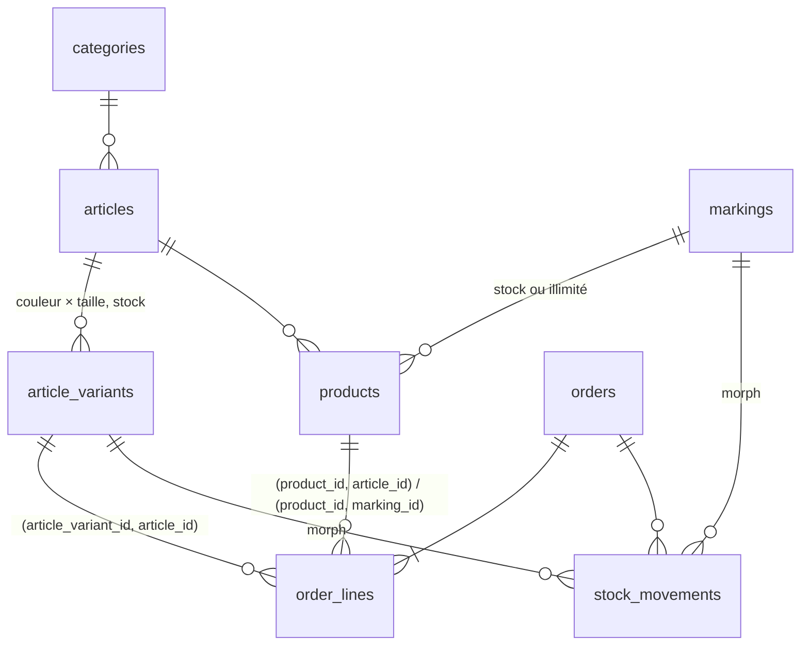

# laravel-composite-stock

[](https://github.com/qoyri/laravel-composite-stock/actions/workflows/ci.yml)

Une boutique de textile personnalisé où **chaque vente consomme deux stocks** :
le vêtement (un t-shirt bleu en M) et le marquage qu'on y pose (les transferts
d'un logo sérigraphié, les écussons brodés). Laravel 13, PostgreSQL, Pest,
Blade + Alpine.

C'est la reconstruction, côté serveur, d'une boutique que j'avais écrite en
ASP.NET Core / Entity Framework (« L'Atelier de l'Humour — Archie Cool »). Le
front reprend l'identité visuelle de la v1 ; le back repart de zéro.

```
PlaceOrder, pour une ligne « J'habite chez mon chat — T-shirt Classique, Blanc / M » :

select * from "products"         where id in (…) order by id for share
select * from "article_variants" where id in (…) order by id for update
select * from "markings"         where id in (…) order by id for update
-- vérification de la demande agrégée par composant, sous verrou
insert into "orders" …  /  insert into "order_lines" …
update "article_variants" set stock = stock - 1 …   + journal
update "markings"         set stock = stock - 1 …   + journal
commit                                   → puis job de confirmation en file
```

> **À lire en premier : [le test de verrou qui passait sans verrou](#le-test-de-verrou-qui-passait-sans-verrou).**
> Trois tests de concurrence étaient verts avec ou sans `lockForUpdate()` : ils
> mesuraient le verrou que pose n'importe quel `UPDATE`, pas celui du code.
> Seul le retrait volontaire des verrous (contrôle par mutation) l'a montré.

---

## Sommaire

1. [Le problème : un produit, deux stocks](#1-le-problème--un-produit-deux-stocks)
2. [Point de départ : ce que faisait la v1](#2-point-de-départ--ce-que-faisait-la-v1)
3. [Modèle de données](#3-modèle-de-données)
4. [Décision : la disponibilité n'est pas stockée](#4-décision--la-disponibilité-nest-pas-stockée)
5. [Décision : l'incohérence est impossible en base](#5-décision--lincohérence-est-impossible-en-base)
6. [Décision : verrouillage pessimiste](#6-décision--verrouillage-pessimiste)
7. [Annulations et ajustements](#7-annulations-et-ajustements)
8. [Comment c'est testé — et comment les tests ont été vérifiés](#8-comment-cest-testé--et-comment-les-tests-ont-été-vérifiés)
   — dont [le test de verrou qui passait sans verrou](#le-test-de-verrou-qui-passait-sans-verrou)
9. [Écueils rencontrés](#9-écueils-rencontrés)
10. [Tour du code](#10-tour-du-code)
11. [Installer et lancer](#11-installer-et-lancer)
12. [Limites assumées](#12-limites-assumées)

---

## 1. Le problème : un produit, deux stocks

- Un **produit vendable** = un **article** textile + un **marquage** (broderie,
  flocage, sérigraphie).
- L'article se décline en **variantes** couleur × taille, chacune avec son stock.
- Le marquage a son propre stock de fournitures — sauf le flocage à la demande,
  **illimité**. Un marquage grand format peut consommer **plusieurs unités par
  pièce** (`units_per_item`).
- Un marquage se pose sur plusieurs articles, un article reçoit plusieurs
  marquages : c'est un *many-to-many*, et le logo « Pas de panique, je suis
  Suisse » vendu sur un hoodie réduit aussi ce qui reste pour les casquettes.

Donc, pour une variante donnée :

```
disponible = min( stock de la variante ,
                  marquage illimité ? ∞ : ⌊stock du marquage / units_per_item⌋ )
```

Et à la validation d'une commande, **les deux** stocks doivent être vérifiés et
décrémentés ensemble, sans que deux clients puissent acheter le même dernier
article.

---

## 2. Point de départ : ce que faisait la v1

La v1 (ASP.NET Core 9 + EF Core + PostgreSQL) est une boutique complète :
paiement, transporteurs, back-office. Son modèle de stock avait des limites que
ce projet corrige. Chaque point ci-dessous
a été relu dans le code avant d'être écrit ; les fichiers et les lignes sont dans
[`docs/v1-notes.md`](docs/v1-notes.md).

| | v1 (.NET) | v2 (ce dépôt) |
|---|---|---|
| Disponibilité | **Stockée** (`ProductImage.CalculatedStock`, `Product.TotalStock`) et maintenue par des **triggers** PostgreSQL | **Calculée** à la lecture, jamais stockée |
| Base du calcul | Somme des stocks **toutes tailles confondues** du textile ; ni le stock réservé ni le marquage n'entrent dans le calcul | `min(variante, capacité du marquage)`, taille par taille |
| Fraîcheur | Aucun trigger sur la table des stocks par taille : modifier une taille ne rafraîchit pas la valeur calculée | Rien à rafraîchir |
| À la commande | **Réserve** (`QuantityReserved + q`) sur l'article textile global, un seul composant | **Décrémente** la variante **et** le marquage |
| Stock par taille | Non décompté | Décompté |
| Marquage | Non décompté | Décompté (sauf s'il est illimité) |
| Annulation / paiement échoué | Change le statut ; la réservation n'est pas libérée | Remet en stock les unités réellement consommées, une seule fois |
| Ligne de commande | `ProductId` seulement | Produit, variante, marquage, unités consommées, prix figés |
| Ajustement manuel du stock par taille / du marquage | Lecture puis écriture de la valeur absolue, sans verrou | Delta signé, sous `FOR UPDATE`, journalisé |

Ce que la v1 faisait bien, et que je garde en tête :

- la réservation était un `UPDATE … WHERE (disponible - réservé) >= q` —
  **atomique et correct** pour le composant qu'il protégeait ;
- l'ajustement du stock global (`InventoryService.UpdateStockAsync`) tournait
  déjà en transaction `Serializable` avec `SELECT … FOR UPDATE`.

Le problème n'était pas l'absence de précautions, mais que la précaution portait
sur un seul des deux composants, au niveau agrégé.

---

## 3. Modèle de données



- **`products` est la table pivot** de `Article ↔ Marking`, déclarée en
  `belongsToMany(...)->using(Product::class)->withPivot(...)`. Elle porte les
  données du couple : `price_cents`, `units_per_item`, `is_active`. Le modèle
  `Product extends Pivot` garde un identifiant auto-incrémenté pour être
  adressable par une route et par les lignes de commande. **Il n'a pas de
  colonne de stock.**
- **`stock_movements`** est un journal en ajout seul, polymorphe
  (`morphTo` vers une variante ou un marquage, morph map imposée). Ce n'est pas
  la source de vérité du stock : il explique comment on y est arrivé.
- Les montants sont des **centimes entiers** (CHF). Affichage suisse :
  `35.– CHF`, `1'250.50 CHF`.
- Contraintes `CHECK` en base : stocks ≥ 0, `total = sous-total + livraison`,
  `total de ligne = prix × quantité`, énumérations, statut cohérent avec la date
  d'annulation, format des couleurs.

---

## 4. Décision : la disponibilité n'est pas stockée

La disponibilité est une **fonction** de deux stocks. La stocker, c'est
s'engager à la recalculer à chaque écriture sur l'un ou l'autre — la v1 montre
ce que coûte un oubli dans cette chaîne (§2).

- `App\Stock\AvailabilityCalculator` est une classe pure, sans requête. La même
  formule sert à la vitrine (sur des modèles chargés d'avance) et à
  `PlaceOrder` (sur les lignes verrouillées) : elles ne peuvent pas diverger.
- Le filtre « disponible uniquement » du catalogue a besoin de la même règle en
  SQL : c'est le scope `Product::available()`.
  **Deux implémentations d'une règle se testent l'une contre l'autre** :
  `AvailabilityScopeTest` vérifie qu'elles sont d'accord sur tout le catalogue
  de démonstration.
- Le coût à la lecture est borné : une page de catalogue fait le même nombre de
  requêtes pour 3 ou pour 12 produits (§8).

Quand est-ce que je stockerais une valeur dérivée ? Pour un catalogue de
centaines de milliers de lignes triées par disponibilité : alors un modèle de
lecture (table ou vue matérialisée) alimenté **par les mêmes Actions** qui
écrivent le stock, et jamais consulté pour décider d'une vente.

---

## 5. Décision : l'incohérence est impossible en base

Une ligne de commande référence un produit, une variante et un marquage. Rien
dans une validation applicative n'empêche une future route, un seeder ou une
requête SQL manuelle d'y écrire « variante d'un hoodie » + « produit t-shirt ».
La base, si :

```php
// order_lines — database/migrations/2026_09_17_100600_create_order_lines_table.php
$table->foreign(['product_id', 'article_id'])
    ->references(['id', 'article_id'])->on('products');
$table->foreign(['product_id', 'marking_id'])
    ->references(['id', 'marking_id'])->on('products');
$table->foreign(['article_variant_id', 'article_id'])
    ->references(['id', 'article_id'])->on('article_variants');
```

Les trois clés composites partagent des colonnes : la variante doit appartenir à
l'article du produit, et le marquage doit être celui du produit. Mentir sur
`article_id` ne sert à rien, l'une des deux clés échoue.
(`products` et `article_variants` portent pour cela un `UNIQUE (id, article_id)`
— redondant pour l'unicité, nécessaire comme cible de clé étrangère.)

`DatabaseIntegrityTest` écrit ces lignes invalides en SQL brut, en contournant
toute l'application, et vérifie que PostgreSQL les refuse avec le nom de la
contrainte attendue.

---

## 6. Décision : verrouillage pessimiste

`App\Actions\Orders\PlaceOrder`, dans une transaction :

1. **`products` en `FOR SHARE`** — le prix et `units_per_item` ne peuvent pas
   changer pendant la validation, mais deux clients qui achètent le même produit
   ne se bloquent pas entre eux.
2. **`article_variants` en `FOR UPDATE`, triées par id.**
3. **`markings` en `FOR UPDATE`, triés par id.**
4. La demande est **agrégée par composant** (`StockDemand`) et comparée aux
   lignes verrouillées. Toutes les ruptures sont collectées : le client corrige
   son panier en une fois (`InsufficientStock`).
5. Création de la commande, décrément des deux composants, journal.
6. `SendOrderConfirmation::dispatch($order)->afterCommit()`.

Le `SELECT … FOR UPDATE` **est** la lecture du stock : il n'y a pas de fenêtre
entre lire et verrouiller. Le second client attend le `COMMIT` du premier, relit
le stock (à 0) et reçoit un refus propre. Tous les écrivains (`PlaceOrder`,
`CancelOrder`, `AdjustStock`) prennent leurs verrous dans le **même ordre**, ce
qui évite les interblocages ; `DB::transaction(…, attempts: 3)` rejoue la
transaction si PostgreSQL en détecte un malgré tout.

### Pourquoi pas autre chose

| Option | Pourquoi je ne l'ai pas retenue ici |
|---|---|
| `UPDATE … SET stock = stock - n WHERE stock >= n` (ce que faisait la v1) | Correct pour un composant. Pour deux, il faut enchaîner deux mises à jour conditionnelles et interpréter les lignes affectées : on sait *qu'*il manque quelque chose, pas *quoi*, et on n'a pas les valeurs pour le journal. C'est une alternative valable, pas une erreur. |
| Verrouillage optimiste (colonne `version`) | Le cas qui compte — plusieurs clients sur le dernier article — est exactement celui où les conflits sont fréquents : on rejoue au lieu d'attendre. |
| Isolation `SERIALIZABLE` | Correct aussi, mais les échecs de sérialisation doivent être rejoués et l'intention (« ces lignes-là ») disparaît du code. |
| File d'attente / verrou applicatif (Redis) | Un composant de plus pour un problème que la base résout, avec la base comme source de vérité. |

La section critique est courte (quelques lignes, quelques millisecondes) : attendre
est préférable à échouer.

Filet de sécurité : `CHECK (stock >= 0)`. Même si le verrou disparaissait d'une
future version du code, la base refuserait la survente — sous forme d'erreur SQL
plutôt que de refus propre (vérifié, §8).

---

## 7. Annulations et ajustements

- **La ligne de commande fige ce qui a été consommé** : `marking_id` et
  `marking_units` (0 si le marquage était illimité à la vente).
  `CancelOrder` rend exactement cela, même si `units_per_item` a changé depuis,
  ou si le marquage est passé d'illimité à fini entre-temps.
- **`CancelOrder` verrouille d'abord la commande** : deux administrateurs qui
  cliquent en même temps ne remettent le stock qu'une fois. Une commande déjà
  annulée n'est pas une erreur d'autorisation, l'action est idempotente.
- **`AdjustStock` prend un delta signé**, jamais une valeur absolue. Un
  formulaire « stock = 15 » ouvert quand il en restait 10 écrase la vente faite
  entre-temps ; « +5 reçus » ne l'écrase pas. Verrou, contrôle `≥ 0`, journal.
  Le stock d'un marquage n'est pas éditable dans son formulaire (la Form Request
  l'interdit) : il ne bouge que par ajustement, vente ou annulation.

---

## 8. Comment c'est testé — et comment les tests ont été vérifiés

**165 tests Pest** sur PostgreSQL (pas de SQLite : il ignore `FOR UPDATE`).

| Zone | Tests | Ce qui est couvert |
|---|---:|---|
| `tests/Unit` | 17 | calcul de disponibilité (minimum, illimité, arrondi `units_per_item`, total plafonné par la capacité partagée), format CHF |
| `tests/Feature/Stock` | 41 | décrément des deux composants, agrégation par composant, refus sans aucune écriture, annulation, ajustements, contraintes en base, scope SQL ≡ calcul PHP |
| `tests/Feature/Shop` | 40 | pages, panier, refus au checkout après une rupture, validation, URL signée |
| `tests/Feature/Admin` | 45 | connexion, limitation des tentatives, **chaque route** du back-office pour invité / staff / admin |
| `QueryCountTest` | 10 | requêtes constantes sur les listes (N+1) |
| `SendOrderConfirmationTest` | 4 | job en file `database`, envoi du mail, reprises |
| `tests/Concurrency` | 8 | verrous et course réelle |

### Concurrence : deux niveaux

**1. Test déterministe des verrous** (`LockingTest`). Pendant que l'Action est
dans sa transaction — observée par `DB::listen` juste après une requête donnée —
une **seconde session PostgreSQL** avec `SET LOCAL lock_timeout = '100ms'` tente
de verrouiller les mêmes lignes. Un verrou tenu donne toujours `SQLSTATE 55P03`.
Pas de `sleep`, pas d'hypothèse de timing. Le test vérifie ce qui est verrouillé
*et* ce qui ne l'est pas :

```
variante commandée            FOR UPDATE  → bloquée
marquage                      FOR UPDATE  → bloqué
autre taille du même article  FOR UPDATE  → libre   (verrou de ligne)
produit                       FOR SHARE   → libre   (les autres clients passent)
produit                       FOR UPDATE  → bloqué  (pas de changement de prix en cours de route)
```

**2. Course réelle entre deux processus** (`LastItemRaceTest`). `pcntl_fork`
crée deux processus, chacun avec sa propre connexion, qui achètent le dernier
t-shirt. Pour que le test soit fiable et pas seulement « généralement vert » :

- **départ commun** : le parent tient un verrou consultatif
  (`pg_advisory_lock`) et ne le relâche qu'une fois `pg_locks` montrant les deux
  enfants en attente ;
- **chevauchement forcé** : le premier enfant qui obtient les verrous de stock
  n'avance pas tant que `pg_stat_activity` ne montre pas l'autre session en
  attente de verrou — la contention est **constatée**, et le test l'exige ;
- quel que soit le gagnant, le résultat attendu est le même : une commande, un
  refus, stock à 0.

Ces tests ont besoin de données validées, visibles d'une autre connexion :
`RefreshDatabase` (une transaction jamais validée par test) ne convient pas. Ils
forment une suite à part, en `DatabaseTruncation`, exécutée en dernier.

### Le test de verrou qui passait sans verrou

Un test de concurrence vert ne prouve rien s'il serait aussi vert sans verrou.
Alors, pour chaque verrou du code, je l'ai retiré et j'ai relancé les tests.

Pour `PlaceOrder`, la mutation était détectée. Pour `CancelOrder` et
`AdjustStock`, **elle ne l'était pas** : les tests restaient verts sans
`lockForUpdate()`. La sonde de la seconde session s'exécutait ici :

```php
probeWhile(
    marker: 'update "orders"',          // après la première écriture
    probe: fn () => $this->canLock('orders', $order->id),
    …
);
```

À ce moment-là, la ligne est verrouillée **de toute façon** : un `UPDATE` pose un
verrou de ligne jusqu'au `COMMIT`, qu'il y ait eu un `SELECT … FOR UPDATE` avant
ou non. Le test mesurait PostgreSQL, pas le code. Or c'est justement la fenêtre
**entre la lecture et l'écriture** que le verrou doit fermer — celle où un second
client lirait le même stock ou annulerait la même commande.

La sonde s'exécute désormais dans cette fenêtre, juste après la lecture
verrouillante et avant toute écriture :

```php
probeWhile(
    marker: 'from "markings" where',    // composants lus et verrouillés, rien écrit
    …
);
```

| Mutation | Sonde après l'`UPDATE` | Sonde avant l'écriture |
|---|---|---|
| `CancelOrder` sans verrou sur la commande | 7/7 verts — **non détectée** | 1 échec — détectée |
| `CancelOrder` sans verrou sur les variantes et marquages | 7/7 verts — **non détectée** | 1 échec — détectée |
| `AdjustStock` sans verrou | 7/7 verts — **non détectée** | 1 échec — détectée |
| `PlaceOrder` sans `lockForUpdate()` | (sonde déjà placée avant l'écriture) | 2 échecs — détectée |

La règle que j'en retiens : **une sonde de verrou se place avant la première
écriture de l'action sur la ligne sondée**, et un test de verrou n'est accepté
qu'après avoir échoué une fois sur la mutation qu'il prétend attraper.

### Les autres contrôles par mutation


- **`lockForUpdate()` retiré de `PlaceOrder`** → le test déterministe **et** la
  course échouent. Dans la course, le second processus ne voit plus de refus
  propre : c'est la contrainte `CHECK (stock >= 0)` qui rejette la survente
  (`SQLSTATE 23514`). **La contrainte est la seconde ligne de défense ; le verrou
  est ce qui transforme la collision en refus compréhensible.**
- **`sharedLock()` retiré** → le test qui exige « produit non modifiable pendant
  la validation » échoue.
- **Course lancée 30 fois de suite** → 30 succès, environ 0,6 s chacune.
- **Eager loading retiré du catalogue, mode strict désactivé** → le test N+1
  échoue (14 requêtes attendues, 32 obtenues).

### N+1 : deux couches

- `Model::shouldBeStrict()` hors production : tout chargement paresseux lève une
  exception, donc chaque test de page échoue sur un N+1.
- `QueryCountTest` : le nombre de requêtes des listes (catalogue, accueil,
  panier, tableau de bord, commandes, produits, articles, marquages, journal)
  ne dépend pas du nombre de lignes affichées, et celui de `PlaceOrder` ne
  dépend pas des quantités.

---

## 9. Écueils rencontrés

Le plus instructif est détaillé plus haut : [le test de verrou qui passait sans
verrou](#le-test-de-verrou-qui-passait-sans-verrou). Les autres :

1. **`min()` en PHP, `LEAST()` en SQL.** `min(5, null)` vaut `null` en PHP ;
   `LEAST(5, NULL)` vaut `5` en PostgreSQL. Un stock `NULL` pour « illimité »
   aurait eu deux sens selon la couche : d'où le booléen `is_unlimited`.
2. **Vérifier ligne par ligne ne suffit pas.** « Bleu M + logo A » et « bleu M +
   logo B » passent chacun contre un stock de 3 ; ensemble il en faut 4. La
   demande est agrégée par composant avant la vérification.
3. **`RefreshDatabase` masque la concurrence** : tout test tourne dans une
   transaction non validée, et un `DB::transaction()` imbriqué devient un
   savepoint. Les tests de concurrence ont leur propre classe de base.
4. **PostgreSQL annule toute la transaction sur une instruction en échec.**
   Supprimer un article protégé par une clé étrangère lève une exception… et
   rend inutilisable la transaction englobante. Le contrôleur vérifie d'abord
   explicitement, et exécute la suppression dans un savepoint (la clé garde le
   dernier mot).
5. **`hasMany()` depuis un modèle `Pivot`** : `Pivot::getForeignKey()` renvoie la
   clé du parent du pivot (ici `null`), pas `product_id`. La relation
   `Product::orderLines()` nomme sa clé explicitement.
6. **Relire `units_per_item` à l'annulation est faux** dès que l'admin l'a
   modifié. Les unités consommées sont figées sur la ligne.
7. **Un formulaire de stock en valeur absolue perd des ventes**, verrou ou pas.
   D'où les deltas.
8. **Job et transaction.** Sans `afterCommit()`, un worker peut traiter une
   commande dont la transaction est finalement annulée.
9. **`pcntl_fork` et PDO.** Un enfant qui détruit une connexion héritée ferme la
   session du parent. Le parent se déconnecte avant le fork ; les enfants
   ouvrent la leur et se terminent par `SIGKILL`.
10. **Services `#[Scoped]` dans les tests HTTP.** Laravel ne les réinitialise
    qu'entre deux jobs (et Octane entre deux requêtes), pas entre deux requêtes
    de test : un récapitulatif de panier mémorisé fuyait d'une requête à
    l'autre. `Tests\TestCase::call()` les oublie avant chaque requête.
11. **`loadMorph()` suppose la relation polymorphe déjà chargée** — il ne charge
    que les relations imbriquées. Le mode strict l'a signalé immédiatement.
12. **Pas de `CHECK` dans le schema builder de Laravel** : les contraintes sont
    posées en `DB::statement()` dans les migrations.

---

## 10. Tour du code

```
app/
├── Actions/                 un cas d'usage par classe, méthode handle()
│   ├── Orders/PlaceOrder    ← le cœur
│   ├── Orders/CancelOrder
│   └── Stock/AdjustStock
├── Stock/                   AvailabilityCalculator, StockDemand, InsufficientStock, Shortage
├── Cart/                    panier en session (#[Scoped]) et son récapitulatif
├── Catalog/                 lectures de la vitrine, filtres, tri
├── Orders/                  CustomerDetails, ShippingFee (#[Config]), OrderReference
├── Http/Controllers/        minces : Form Request → Action / service → vue
├── Http/Requests/           toute la validation (et authorize() via les policies)
├── Policies/                admin : tout ; staff : lecture + ajustements de stock
├── Jobs/SendOrderConfirmation
├── Models/                  relations, casts enum, scopes (#[Scope]) — pas de logique métier
└── View/Components/Shop/    en-tête et tiroir panier (composants avec injection)
```

Conventions Laravel utilisées et pourquoi :

- **Actions** : Laravel n'a pas de notion officielle ; ce sont des classes
  simples, injectées par le conteneur. Pas de package.
- **Form Requests** : les contrôleurs ne valident rien. La vérification de
  disponibilité à l'ajout au panier est un hook `after()` de la Form Request —
  une courtoisie pour le client, la décision appartient à `PlaceOrder`.
- **Policies** découvertes par convention de nommage ; `Gate::authorize()` dans
  les contrôleurs (le `Controller` de base n'a plus `AuthorizesRequests` depuis
  Laravel 11) et `authorize()` dans les Form Requests.
- **Liaison de route explicite** `{sellableProduct}` : une URL de la vitrine ne
  résout qu'un produit vendable.
- **URL signée** pour la confirmation de commande : pas de compte client, pas
  d'identifiant devinable.
- **`#[Scoped]`, `#[Config]`, `#[Scope]`, `#[Fillable]`, `#[RouteKey]`** :
  attributs PHP de Laravel 12/13 plutôt que propriétés magiques.
- **Front** : Blade + Tailwind 4 + Alpine.js. Le design (palette, typographie
  Inter/Fredoka, capitales espacées, boutons carrés, tiroir panier, en-tête
  compact au défilement) reprend la v1 Next.js. **Pas de Livewire** : la fiche
  produit reçoit la matrice de disponibilité en JSON et Alpine choisit la
  combinaison ; une disponibilité « en direct » n'aurait rien garanti de plus que
  la vérification sous verrou. Faute de photos, `<x-garment-preview>` dessine le
  vêtement en SVG, dans la couleur de la variante, avec le slogan.

---

## 11. Installer et lancer

Prérequis : PHP ≥ 8.3, testé en 8.4 et 8.5 (`pdo_pgsql`, `intl`, `pcntl` et `posix` pour le test de course),
Composer, Node 22, Docker.

```bash
cp .env.example .env
composer install
php artisan key:generate
docker compose up -d                 # PostgreSQL :5433 (bases dev + test), Mailpit :8025
php artisan migrate --seed
npm ci && npm run build
php artisan serve                    # http://localhost:8000
php artisan queue:work               # envoie les confirmations (visibles dans Mailpit)
```

| Compte back-office (`/admin`) | Mot de passe | Droits |
|---|---|---|
| `admin@archiecool.test` | `password` | tout |
| `staff@archiecool.test` | `password` | lecture, ajustements de stock |

Qualité (les trois sont bloquants en CI) :

```bash
composer test                        # Pest, suite Concurrency comprise
vendor/bin/pest --exclude-group=concurrency
composer analyse                     # PHPStan, niveau max, sans baseline
vendor/bin/pint --test
```

---

## 12. Limites assumées

- **Pas de paiement ni de transporteur** : la commande est confirmée à la
  validation. Avec un paiement, j'ajouterais un statut « en attente » et une
  expiration qui rend le stock via `CancelOrder` — la mécanique est déjà là.
- **Pas de réservation au panier** : le stock est décrémenté à la validation,
  pas à l'ajout. C'est le choix habituel pour une boutique de ce volume ; la
  page panier signale les lignes devenues impossibles.
- **Pas de compte client** (session et URL signée), conformément au périmètre.
- Le catalogue ne trie pas par disponibilité (§4).
- Les aperçus sont des illustrations SVG, pas des rendus de production.

Le plan de travail et les notes de vérification sur la v1 sont dans
[`docs/`](docs/).
